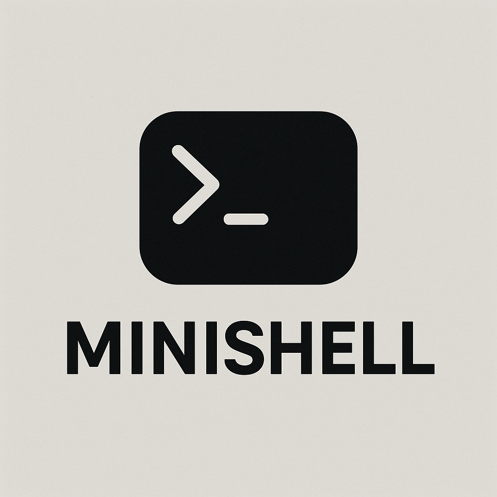

Minishell

A simple UNIX command-line interpreter (shell) written in C, implementing a subset of bash features.

Features
Mandatory Part
Prompt display with current working directory

Command history (up/down arrows to navigate)

Command execution:

Absolute paths (/bin/ls)

Relative paths (./minishell)

PATH resolution (ls, grep, etc.)

Quoting:

Single quotes (') - preserves literal value

Double quotes (") - allows variable expansion

Redirections:

Input (<)

Output (>, >> for append)

Heredoc (<<)

Pipes (|) - multiple commands chained together

Environment variables ($VAR expansion)

Special variables ($? for exit status)

Signal handling:

Ctrl-C (interrupt)

Ctrl-D (EOF)

Ctrl-\ (quit)

Builtins:

echo with -n option

cd

pwd

export

unset

env

exit

Installation
Prerequisites
macOS (tested on recent versions)

Homebrew package manager

Xcode Command Line Tools

Compilation Steps
Install readline library:

bash
brew install readline
Clone the repository:

bash
git clone https://github.com/0xCheckMate/minishell
cd minishell
Compile the project:

bash
make
This will create the minishell executable.

Run the shell:

bash
./minishell
Usage
Run the executable:

bash
./minishell
You'll see a prompt where you can enter commands:

text
$ 
Example commands:

bash
$ ls -la
$ echo "Hello $USER"
$ cat < file.txt | grep "search" > output.txt
$ exit
Makefile Targets
make or make all - Compiles the project

make clean - Removes object files

make fclean - Removes object files and the executable

make re - Recompiles the project

Project Structure
text
minishell/
├── Makefile
├── minishell.h
├── parsing/       # Command parsing and tokenization
├── execution/     # Command execution and redirection handling
├── built_in/      # Builtin command implementations
